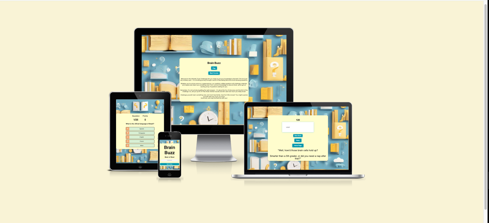
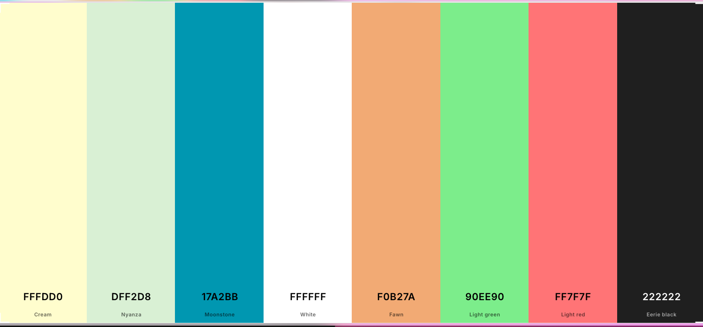
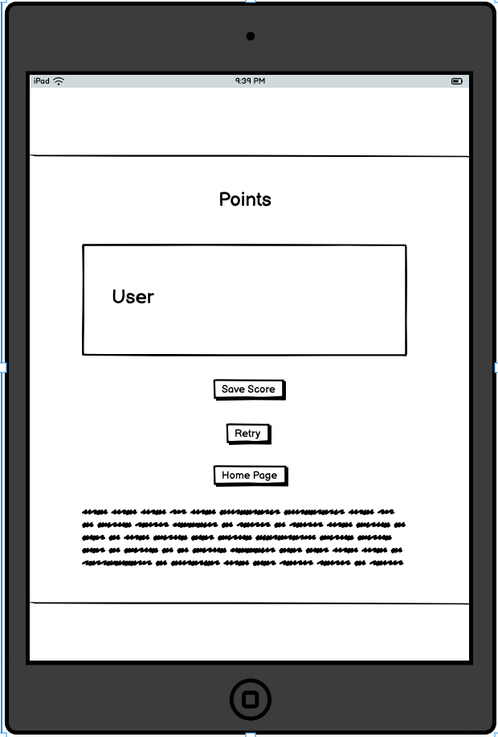
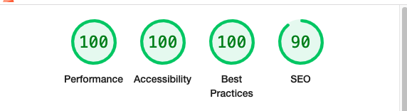
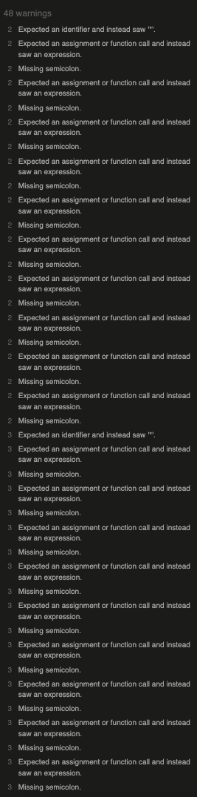

# Brain Buzz

## Introduction

Welcome to my quiz game project! I've always been fascinated by trivia games and quizzes. I believe they not only exercise the mind but also offer an endless opportunity to learn new things. This project is a reflection of my passion for creating engaging and educational experiences. Whether you're here to challenge yourself or to discover intriguing facts, I hope you find this quiz enjoyable and enriching. Dive in and start exploring the world of trivia!

## User Objectives

* Intuitive and straightforward gameplay.
* Engaging and captivating trivia experience.
* Visually appealing interface.
* High score leaderboard to track top performances.

## User Narratives:

* As a player, I wish for the quiz to be straightforward and easy to grasp.
* As a player, I hope the quiz will be enjoyable and engaging.
* As a player, I desire a site with a compelling and attractive design.
* As a player, I expect to see a leaderboard showcasing top scores.
* As a player, I want to challenge my manga knowledge and discover intriguing facts.

## Site Objectives:

* To develop a quiz that is enjoyable and captivating for users.
* To design a visually attractive quiz to attract and retain users.
* To produce content that amuses and captivates users.
* To ensure the quiz is accessible to all potential users.

## Requirements:

* Simple gameplay.
* Visually appealing design.
* Engaging and entertaining content.
* Accessibility for all user groups.
* High score leaderboard.

## Design Choices

### Fonts 

[Google Fonts](https://fonts.google.com/ "Google Fonts") 

This project utilizes Google Fonts, specifically the Inter font, to ensure a consistent and cohesive appearance across all pages. By using a single font, we aim to maintain a unified design aesthetic, minimizing distractions and enhancing readability for users. The simplicity of Inter supports a clean and professional look, allowing the content to take center stage.

### Colours

A variety of colors has been employed throughout the project to create an engaging and vibrant visual experience. Careful consideration was given to ensure that the colors complement each other, providing a harmonious and soothing aesthetic. This approach was chosen to enhance the overall user experience, allowing the design to be visually appealing without being overwhelming or distracting.

* #FFFDD0 - To provide a harmonious contrast, the color FFFDD0, a soft cream, is used to divide the Goldenrod background in the middle, offering an appealing backdrop for the central content. On the "Best Scores" page, while the Goldenrod spans the entire page, FFFDD0 is featured as the background color for the "best of the best" container in the center, enhancing its prominence and providing a visually pleasing highlight against the Goldenrod.

* #DFF2D8 - The color #DFF2D8 was utilized as the background for the answers container, providing a gentle and soft backdrop.

* #222 - The color #222 was selected for the page font, offering a sleek and modern look that ensures readability and complements the overall design.

* #17A2B8 - The color #17A2B8 has been used for all the buttons throughout the project, adding a vibrant and inviting touch that enhances user interaction and complements the site's overall aesthetic.

* #FFFFFF - The color #FFFFFF was used for the fonts inside the buttons, providing clear and crisp contrast against the button color for optimal readability.

* #F0B27A - The color #F0B27A was used as the background color for the option letters A, B, C, D, and E, offering a warm and inviting look that distinguishes the options clearly.

* #90EE90 - The color #90EE90 was used to indicate when a user answers a question correctly, providing a pleasant and positive visual feedback.

* #FF7F7F - The color #FF7F7F was used to highlight when a user answers a question incorrectly, offering a clear and immediate visual cue.

* * Note - The colors mentioned—#FFFDD0, #222, #17A2B8, #FFFFFF, #F0B27A, #90EE90, and #FF7F7F—are the most prominent within the project and are clearly visible throughout the design, playing a key role in shaping the user experience. While these are the main colors used, there might be some colors that I inadvertently 
forgot to mention.

### Structure

* The quiz site consists of three main pages, or four if we include the "Best of Best Scores" page. The first page is the welcome page, featuring motivational text that explains the benefits and enjoyment of taking quizzes. This page also contains two buttons: one to start the game and another to view the top scores. Once the "Play" button is pressed, users are taken to the second page, where they can begin answering questions. This page includes a question counter and a score counter. After all questions have been answered, users proceed to the third page. The third page provides humorous text, along with buttons for "Home Page" and "Retry," allowing users to play again and aim to improve their scores. After entering their username and pressing the "Save" button to save their score, users are automatically redirected to the main page. A fourth page is accessible via the "Best Scores" button on the main page.

## Features

### Favicon

* The favicon was created using two complementary colors and features the name of the quiz along with my initial, "Y."

* The favicon was designed utilizing the tool available at [favicon.io](https://favicon.io/ "favicon.io") .

### Quiz Name

* I chose the name "Brain Buzz" because it perfectly encapsulates the excitement and stimulation that quizzes provide. The word "Brain" highlights the focus on engaging and challenging your intellectual abilities, while "Buzz" suggests the energizing and lively feeling that comes from learning and discovering new things. Together, "Brain Buzz" conveys the idea of an exhilarating mental workout that's both fun and enriching. It's a name that reflects the dynamic and interactive experience I want to offer to users, keeping their minds active and curious.

### First Page 

* The first page of our quiz game is designed to warmly welcome and motivate you to embark on a journey of fun and learning. It features an inspiring message that highlights how enjoyable and rewarding playing a quiz can be. Quizzes not only challenge your knowledge but also provide a fantastic opportunity to discover new facts and have fun along the way. To begin your adventure, simply click the "Play" button, which will take you directly to the start of the game. If you're curious to see how you stack up against the best, the "Best Scores" button will lead you to the "Best of Best" page, where the top scores are showcased. Dive in and let the challenge begin!

### Game Page

* The game page is where the excitement truly begins. Here, you'll be presented with a series of questions, each offering five possible answers. As you navigate through the quiz, a question counter keeps track of your progress, allowing you to see how far you've come. Meanwhile, a points counter tallies your correct answers, giving you real-time feedback on your performance. This dynamic setup ensures that you're always aware of your standing, adding an engaging layer of challenge as you strive to increase your score. Get ready to test your knowledge and enjoy the thrill of the quiz!

### Scores Page

* Upon completing the quiz, you'll be directed to the scores page, where you can view your results and submit your score with the "Save" button. This page offers a clear overview of how well you've performed, celebrating your achievements and encouraging you to aim even higher. Once you submit your score, you'll be automatically redirected to the home page, making it easy to start a new session or explore other features. Additionally, the page provides two convenient buttons: one to return to the home page and another to play again. Whether you're eager to take on the quiz once more or simply want to reflect on your performance, the scores page serves as a perfect culmination of your quiz experience.

### Best Scores Page

* The "Best Scores" page, which you can access from the home page by clicking the "Best Scores" button, showcases the top performances within the quiz game. Here, you'll find a leaderboard highlighting the highest scores, inspiring a friendly competition among players. This page serves as a motivating benchmark, challenging you to improve your score and see how you measure up against other quiz enthusiasts. It's an exciting addition that not only acknowledges the best players but also encourages everyone to aim for the top spot.

#### Wireframes

- The wireframes were created using [Balsamic](https://balsamiq.com "Balsamic").

- These are the initial wireframes I developed prior to starting the project. Although there were some minor changes during the process, I strived to maintain and closely follow my initial vision.

## Desktop 

## Mobile

## Ipad

### Testing 

### Functional Testing

#### Play Button

* Feature Overview - Engaging button designed to initiate the quiz.
* Anticipated Result - Clicking the button should direct the user to the quiz screen, displaying the first question along with the counters.
* Procedure - Clicked the start button.
* Outcome - Functioned as intended.

#### Best Scores Button

* Feature Overview - Interactive button designed to open the best scores section.
* Anticipated Result - Clicking the button should display the best scores screen. Initially, it should not show any scores until the first score is submitted.
* Procedure - Clicked the open best scores button; no high scores were displayed on initial launch.
* Outcome - Functioned as intended.

#### Retry Button 

* Feature Overview - Interactive button designed for restarting the quiz.
* Anticipated Result - Clicking the button should redirect the user directly to the game page to start a new game, with counters reset to zero and questions reloaded.
* Outcome - Functioned as intended.

#### Home Page Button

* Feature Overview - Interactive button designed to navigate back to the home page.
* Anticipated Result - Clicking the button should redirect the user to the main page, from which they can choose to start a new game or view the best scores. This button is also available on the best scores page and functions similarly there.
* Procedure - While on an active page or the best scores page, click the home page button; confirm redirection to the main page and availability of options to start a new game or access the best scores.
* Outcome - Functioned as intended.

#### Question Counter

* Feature Overview - A counter that indicates to the user which question they are currently on.
* Anticipated Result - Should begin at 1 and increment by 1 after the user answers each question.
* Procedure - Start the quiz and progress through a few questions.
* Outcome - Functioned as intended.

#### Score Counter

* Feature Overview - A counter that informs the user of their current score.
* Anticipated Result - Should begin at 0 and increase by 15 for each correct answer provided.
* Procedure - Start the quiz and verify that the counter increments with correct answers and remains unchanged with incorrect answers.
* Outcome - Functioned as intende

#### Correct or Incorrect Feedback 

* Feature Overview - Provide feedback to inform the user if their chosen answer is right or wrong.
* Desired Outcome - When an answer is chosen, the container of the correct answer should highlight in green, and red if the answer is incorrect.
* Testing Procedure - Begin the quiz, choose a correct answer, then choose an incorrect answer.
* Result - Performed as anticipated.

#### Next Question 

* Feature Overview - After a question is answered, the following question will be displayed.
* Desired Outcome - After responding to a question or at the initial load, the next question should appear. The question just answered should no longer be among the available questions.
* Testing Procedure - Initiate the quiz and answer a question. Use the console log to verify that the previously shown question has been removed from the list of available questions.
* Result - Functioned as expected.

#### Final Score Page

* Feature Description - Upon answering 25 questions, the quiz will conclude, and a results window will appear presenting the final score.
* Desired Outcome - Once all 25 questions have been answered, the quiz should finish, and a results window should display the final score.
* Testing Procedure - Start and complete the quiz.
* Result - Performed as expected. The window displaying the score showed the outcomes successfully.

#### Save Score Button 

* Feature Overview - Allows players to record their score by providing a username, then returns them to the main page after a successful submission.
* Intended Behavior - Successfully submitted scores are stored in session storage and showcased on the "Best of the Best" list. The system maintains only the * top 5 scores, removing the lowest if a new, higher score is submitted. Scores are displayed from highest to lowest. Without a username, score submission is prevented; players can only return to the home screen or start a new game via dedicated buttons.
* Test Approach - Multiple quiz completions with varying outcomes were performed. Attempts were made to submit scores without entering usernames.
* Outcome - The feature functioned as designed in all test scenarios.

### Validator

* The HTML and CSS code have been validated using [W3C Markup Validation](https://validator.w3.org/#validate_by_input "W3C Markup Validation") and [W3C CSS Validation](https://jigsaw.w3.org/css-validator/#validate_by_input "W3C CSS Validation"). All code has validated successfully without errors.

#### CSS Testing

* Style CSS file testing :

* Play CSS file testing :

#### HTML Testing

* Index HTML Result : 

* Game HTML Result : 

* Final HTML result :

* Best Scores HTML result :

### Lighthouse Testing

* Mobile Lighthouse Testing :

* Desktop Lighthouse Testing :

## Note :

* The website underwent Lighthouse testing for both desktop and mobile versions. It achieved high scores across most categories, with a 90% score specifically in the SEO section for both platforms. This demonstrates strong search engine optimization practices.

The 10% deduction in the SEO score is due to minor suggestions:

1. A potentially malformed robots.txt file
2. Some missing image alt attributes
3. Absence of a canonical link

These issues don't significantly impact the website's search engine performance or user experience. They're optimization suggestions rather than critical problems. Given the high SEO score for both desktop and mobile, the current implementation successfully meets SEO requirements while leaving room for future fine-tuning if deemed necessary.

#### JavaScript Testing

- The JavaScript code has been validated using [JSHint](https://jshint.com/ "JSHint") and produced the following results.

* script.js and final.js files :

- JSHint Warnings and Code Metrics Explained

When you run JSHint on this project, you might see warnings about ES6 features. Don't worry – these aren't errors in your code. They just show that we're using modern JavaScript.

These warnings mention things like 'const', 'let', arrow functions (=>), and the spread operator (...). All of these are part of ES6, which is a newer version of JavaScript.

JSHint is telling us that we're using these new features. If you're building for modern browsers or recent versions of Node.js, you can ignore these warnings. Your code will work fine.

Important Note: Despite these warnings, the code is functioning correctly and as intended. There's no need for intervention or changes based on these JSHint warnings alone. The code is working well in its current state.

* bestscores.js file :

-When running JSHint on the project files, several warnings may appear:

"Expected an identifier and instead saw ''":
This typically occurs when CSS comments (/ */) are interpreted as JavaScript.

"Expected an assignment or function call and instead saw an expression" and "Missing semicolon":
These are also related to CSS being parsed as JavaScript.

"Unbegun comment":
This might indicate a malformed comment in a CSS file.

ES6-related warnings:

"'arrow function syntax (=>)' is only available in ES6 (use 'esversion: 6')"
"'const' is available in ES6 (use 'esversion: 6') or Mozilla JS extensions (use moz)"
"'template literal syntax' is only available in ES6 (use 'esversion: 6')" These indicate the use of modern JavaScript features.
Most of these warnings are due to JSHint attempting to parse CSS as JavaScript, which it's not designed to do. For the JavaScript-specific warnings, they're flagging the use of ES6 features.

Important Note: The code is functioning correctly despite these warnings. No intervention is needed, and these warnings do not affect the code's performance or functionality.

* Separate note for both texts:

Due to time constraints, it has been decided not to investigate these warnings further. The current code is working as intended, if more time was available, some research into fixing this issues would be done.

### WAVE Testing 

## Note 

* The WAVE accessibility test identified two areas for potential improvement in the website: contrast issues and heading structure. These are important considerations for accessibility, but it's crucial to note that they do not critically impact the core functionality of the site.

Contrast: Some text elements have lower contrast with their backgrounds than recommended by accessibility guidelines. While this may affect readability for some users, particularly those with visual impairments, it does not prevent the site from functioning as intended.

Heading Structure: Some text that appears to be a heading is not marked up with proper heading tags (h1-h6). This doesn't affect how the content displays visually but may impact how screen readers interpret the page structure.

These issues are part of web accessibility best practices rather than critical errors. They don't break any features or prevent users from interacting with the site. The website remains fully functional and usable for the vast majority of visitors.

However, we acknowledge the importance of continuous improvement. While these aren't urgent fixes, they represent opportunities to enhance the site's accessibility in the future. If any functionality issues arise or if these minor accessibility points begin to affect user experience, they will be addressed promptly.

The focus has been on delivering a functional, engaging quiz experience, which has been successfully achieved. Future iterations of the site may incorporate these accessibility enhancements to further improve the user experience for all visitors."

This text acknowledges the issues while reassuring that they don't critically impact the site's functionality, and it indicates a commitment to addressing any actual functionality issues that might arise in the future.

## Used Technologies 

### Languages

* [HTML](https://en.wikipedia.org/wiki/HTML "HTML")
* [CSS](https://en.wikipedia.org/wiki/CSS "CSS")
* [JavaScript](https://en.wikipedia.org/wiki/JavaScript "JavaScript")

### Libraries & Framework

* [Google Fonts](https://fonts.google.com "Google Fonts")

### Tools 

* [GitHub](https://github.com/ "GitHub")
* [Gitpod](https://gitpod.io "Gitpod")
* [Coolors](http://coolors.co "Coolors")
* [favicon.io](https://favicon.io/ "favicon.io")
* [DevTools](https://developer.chrome.com/docs/devtools "DevTools")
* [W3C Markup Validation](https://validator.w3.org/#validate_by_input "W3C Markup Validation")
* [W3C CSS Validation](https://jigsaw.w3.org/css-validator/#validate_by_input "W3C CSS Validation")
* [WAVE Web Accessibility Evaluation Tool](https://wave.webaim.org/ "WAVE Web Accessibility Evaluation Tool")
* [Balsamic](https://balsamiq.com "Balsamic")
* [JSHint](https://jshint.com/ "JSHint")
* AI Image Generator 

## Deployment 

The site was deployed using GitHub. The steps for deployment are as follows:

1. Navigate to the GitHub project repository.
2. Go to the settings tab.
3. Find the page settings under Code and automation.
4. Under Build and deployment, select Deploy from branch as the source.
5. Ensure the main branch is selected and click save.
6. After completing these steps, the page should be live within a few minutes.
7. Your live project will be accessible at http://your-username.github.io/your-project-title/.

#### Note to Read

* In this project, after encountering initial challenges, I adopted a different approach. Following extensive research, I decided to implement a strategy where I separated each component into distinct pages. This modular approach proved to be more efficient and helped reduce errors.

The project structure is as follows:

The index.html page, styled with style.css, serves as the main entry point.

The game functionality is contained in game.html, which uses play.css for styling and script.js for its interactive elements.

The final.html page, which utilizes styles from style.css, has its JavaScript logic in a separate file named final.js. This separation was implemented after encountering a bug that was hindering the proper functioning of the code.

A fourth page, bestscores.html, was created with its CSS elements integrated into the main style.css file. To maintain consistency and prevent potential issues, its JavaScript functionality was isolated in a separate bestscores.js file.

This modular approach, with separate HTML, CSS, and JavaScript files for different components, emerged as a solution to bugs encountered during the coding process. I found that this method of organizing the project not only helped in reducing mistakes but also proved to be more efficient for development and debugging.

The decision to separate the code into several pages was a direct result of the challenges faced during the project's development. This approach allowed for better organization, easier troubleshooting, and improved overall code management.

### Images

- Used Image :

- The background image was created using an AI image generator. It visually represents a quiz game, utilizing pastel colors that harmonize beautifully with the color scheme of the question and answer container on the page.

### Bugs

* I attempted to find bugs but did not encounter any. I tested all the buttons and features that I had planned for the game, and they all function as expected. I acknowledge that the page is not perfect and there is certainly room for improvement. However, due to time constraints, it will remain in its current state for now. If people enjoy the game and feedback is positive, the game can be expanded and improved by adding more sections.If any bugs do arise, they will be addressed and fixed immediately.

#### Credits

- [Fatme Ali](https://www.linkedin.com/in/fatme-ali-795233160/) My deepest thanks to my amazing wife, Fatme Ali. Her unwavering support and encouragement were crucial throughout this project. Her strength and positivity made every hurdle surmountable, turning challenges into opportunities for growth.

- [Iuliia Konovalova](https://github.com/IuliiaKonovalova) I'm deeply grateful to my mentor for her invaluable guidance and constant support. Her wisdom and motivation have been instrumental in shaping this project and my growth. Her mentorship has been a cornerstone of this journey, inspiring me to reach new heights.

- [Code Institute](https://codeinstitute.net/global/) I extend my sincere gratitude to the Code Institute and its vibrant Slack community of tutors and mentors. Your continuous assistance, expert advice, and motivational support have been crucial to my educational progress and the successful completion of this project. Your dedication has truly enriched my learning experience.

- [GitHub](https://github.com/) A heartfelt nod to the minds behind GitHub. Their platform has been a game-changer, opening doors to a world of collaborative coding and continuous learning. It's more than just a tool; it's been a catalyst for growth in my development journey.

- The concept of understanding how JavaScript code functions in a quiz game stems from https://www.youtube.com/@JamesQQuick.